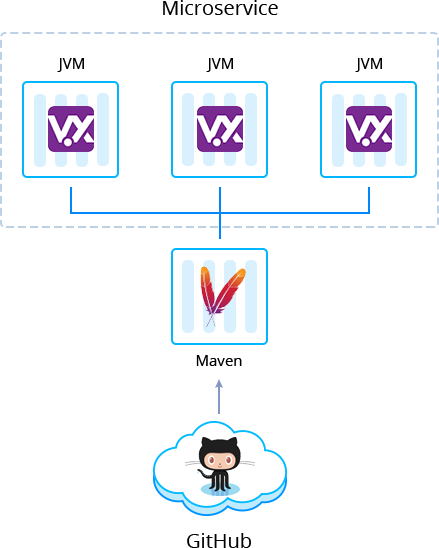

 

# Vert.x Microservice Application

The [Vert.x](https://vertx.io/) is the right tool-kit to build your reactive systems with polyglot capabilities. Considering the microservice architecture, each application component can be built, deployed, scaled or replaced independently, reaching amazing elasticity and flexibility.

With Vert.x, you can create high performing and asynchronous microservices packaging them in two different ways with Jelastic JAR Builders:

- [Fat](https://github.com/jelastic-jps/vertx/blob/master/microservice-fat-jar), a self-contained single *JAR* file with all necessary dependencies inside. Usually, the archive is of a big size as it contains everything including application server runtime.

- [Thin](https://github.com/jelastic-jps/vertx/blob/master/microservice-thin-jar), a *JAR* file that doesn’t contain runtime and dependencies by default but automatically downloads them during the first launch. It is considered as the most widely used approach nowadays, as it was the only one well standardized for many years and provides a set of advantages, such as faster and more efficient process of building and packaging.

 

### Managed Hosting Business on Vert.x Microservices

To start offering this solution to your customers please follow to [Managed PaaS Hosting Business](https://jelastic.com/apaas/)